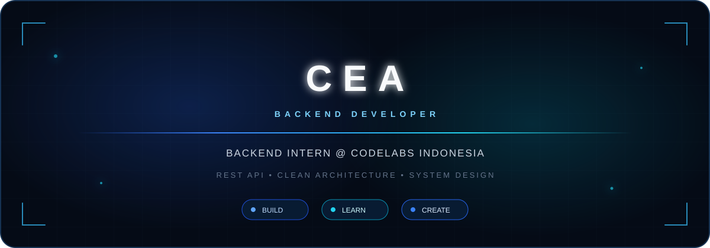

<div align="center">



<br>

[](https://github.com/ceacodesnclass-rgb)
[](mailto:ceacodesnclass@gmail.com)
[](https://instagram.com/_zrvnfy)

</div>

## `> whoami`

```yaml
name: Cea
role: Backend Developer
currently: Backend Intern @ Codelabs Indonesia
focus:
  - REST API Development
  - Clean Architecture
  - System Design
creative_side:
  - UI/UX Design
  - Beginner Streamer
```

> A beginner backend developer learning to build clean, reliable APIs and useful digital experiences—one commit at a time.

## `> tech --list`


## `> learning_journey`

| `COMPLETED` | `IN PROGRESS` | `NEXT TARGET` |
|:--|:--|:--|
| Git & GitHub | Laravel | Docker |
| REST API Basics | Strapi CMS | Redis |
| CRUD Operations | Authentication | Testing |
| PostgreSQL Basics | Database Relations | CI/CD |
| Frontend API Integration | Backend Features | Clean Architecture |
|  |  | System Design |

## `> system_analytics`

<div align="center">
  
  
</div>

<div align="center">
  
</div>

## `> featured_deployments`

<div align="center">
  <a href="https://github.com/ceacodesnclass-rgb/chizzuu-gesture-blur-camera">
    
  </a>
</div>

## `> beyond_coding`

```text
🎨  UI/UX & creative editing
🎥  Content creation & filmmaking
🎮  Beginner streamer
🎹  Keyboard & learning guitar
```

<div align="center">

> **Learn the flow before writing the code.**

<sub>BUILD · LEARN · CREATE</sub>

<br><br>

[](https://tiktok.com/@_zodvn)
[](https://tiktok.com/@_zodvn.2)

</div>
